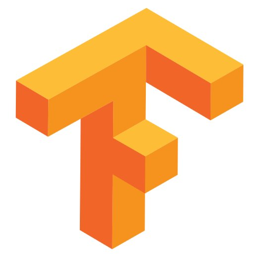
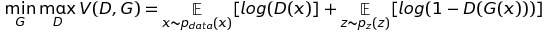
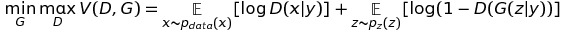
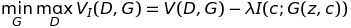
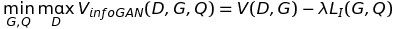
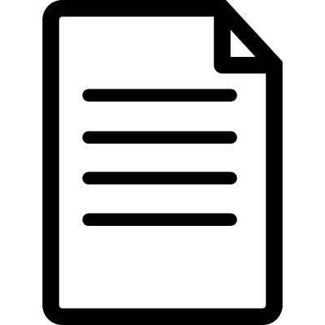
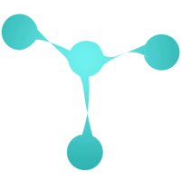

## GANs and it's improvements
- [Generative Adversarial Networks](https://arxiv.org/abs/1406.2661): The original paper which proposed the concept of GANs. 

- [Unsupervised Representation Learning with Deep Convolutional Generative Adversarial Networks](https://arxiv.org/abs/1511.06434): The first GAN paper which uses a deep convolutional network for generative and discriminative networks. [TensorFlowCodeTutorial](http://bamos.github.io/2016/08/09/deep-completion/) 

- [Conditional Generative Adversarial Nets](https://arxiv.org/abs/1411.1784): Talks about conditioniong latent space based on class.  
 

- [Wasserstein GAN](https://arxiv.org/abs/1701.07875): Improves stability by getting rid of mode collapse problem by using an alternative formulation.  

- [InfoGAN: Interpretable Representation Learning by Information Maximizing Generative Adversarial Nets](https://arxiv.org/abs/1606.03657): Talks about priming latent space to learn specific functionality for specific parts of the latent space.  
 
 

- [GANHacks](https://github.com/soumith/ganhacks): Some hacks by Soumith Chinthala to stabilize GAN training. 

- [Generative Adversarial Text to Image Synthesis](https://arxiv.org/abs/1605.05396): Generates realistic images from text (fine example of zero shot learning).     

- [Plug & Play Generative Networks: Conditional Iterative Generation of Images in Latent Space](https://arxiv.org/abs/1612.00005):  This paper introduces an additional prior on the latent code, improving both sample quality and sample diversity, leading to a state-of-the-art generative model that produces high quality images at higher resolutions. 

- [Stabilizing Adversarial Nets With Prediction Methods](https://arxiv.org/abs/1705.07364): Stabilizes GAN training using PDHG methods. 

- [Unpaired Image-to-Image Translation using Cycle-Consistent Adversarial Networks](https://arxiv.org/abs/1703.10593): Amazing paper on unpaired image to image translation.   

- [Deep Metric Learning using Triplet Network](https://arxiv.org/abs/1412.6622): Talks about using Triplet loss to learn useful metrics. 

- [Deep Supervised Hashing with Triplet Labels](http://www.cs.cmu.edu/~kkitani/pdf/WSK-ACCV16.pdf): Concept of using Triplet loss for hashing in neural nets.  

#### TODO
- [ ] Add papers regarding alternative representations to voxels (surfles and so on).
- [ ] Add papers regarding OctTree and QuadTree based repsentations in neural nets for object recognition.

***
