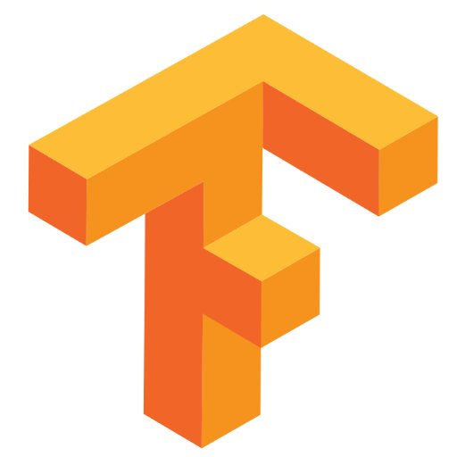

# AwesomePapers 

All the awesome papers I've seen.

## Update Notes:
Update Notes can be [found here](MDFiles/UpdateNotes.md)

## Table of Contents:
- [Binary Neural Networks](MDFiles/BNN.md)
- [Compressing Neural Networks](MDFiles/CompressingNN.md)
- [Multi-view Geometry using Deep Learning](MDFiles/GeometricDL.md)
- [Optical Flow](MDFiles/OpticalFlow.md)
- [Sensor Fusion](MDFiles/SensorFusion.md) 
- [Quadrotor](MDFiles/Quadrotor.md)
- [3D Neural Networks](MDFiles/3DCNN.md) 
- [GAN](MDFiles/GAN.md)
- [Spectral Convolutional Neural Networks](MDFiles/SpectralCNN.md)

## Legend:
- Tensorflow: 
- Keras: 
- Caffe: 
- Caffe 2: 
- Paper Summaries/Documentation: 
- Matlab/Matconvnet: 
- Theano: 
- Torch: 
- PyTorch: 